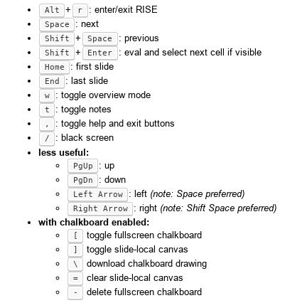

# Notes

## Environment

The commands below use Anaconda to manage the project environment.

```bash
conda env create -f environment.yml

conda env update -f environment.yml

conda activate droids-env

# in case of error 'Your shell has not been properly configured ...', try 'source ...'
source activate droids-env

conda deactivate
```

## Jupyter

```bash
jupyter notebook &

# convert to HTML slides or use RISE for a dynamic slideshow
jupyter nbconvert hello.ipynb --to slides --post serve
```

### RISE slideshow

RISE turns a Jupyter notebook into a live `reveal.js`-based presentation - the code
cells can be executed in presentation mode. You can also edit the code.

#### Keyboard shortcuts



#### Customizing RISE

To change the presentation theme:

1. Go to _Edit / Edit Notebook Metadata_
2. Append `"rise": {"theme": "sky"}` to the JSON content
3. (!) Restart the notebook for the changes to take place

Check the [documentation](https://rise.readthedocs.io/en/maint-5.5/customize.html#choosing-a-theme)
for other settings that can be customized.

### Font size for code blocks

1. The package [jupyter_contrib_nbextensions](https://jupyter-contrib-nbextensions.readthedocs.io/en/latest/install.html#install-javascript-and-css-files)
   is installed as part of the project Conda environment.

2. Run `jupyter contrib nbextension install --user` to enable it.

3. Enable the extensions you want to use:

   ```bash
   jupyter nbextension enable code_font_size/code_font_size
   jupyter nbextension enable execute_time/ExecuteTime
   ```

   To specify the extension, you need to pass `extension_dir/extension_js_file`.
   To see what they are check the extensions directory - on my laptop, the files are located in
   `~/.pyenv/versions/miniconda3-latest/envs/droids-env/lib/python3.7/site-packages/jupyter_contrib_nbextensions/nbextensions`.

## Arithmetic of word vectors

The function `cosine_similarity` expects 2 arrays of shape `(n_samples_X, n_features)`.

When using it to calculate a similarity of vectors `A` and `B`, you may get error:

> ValueError: Expected 2D array, got 1D array instead:  
> array=[1. 1. 1.].  
> Reshape your data either using array.reshape(-1, 1) if your data has a single feature
> or array.reshape(1, -1) if it contains a single sample.

In that case, either use `reshape` as advised in the error message or convert each vector into
an artificial 2D array `[A]` and `[B]`:

```python
from sklearn.metrics.pairwise import cosine_similarity
cosine_similarity([A], [B])
```
